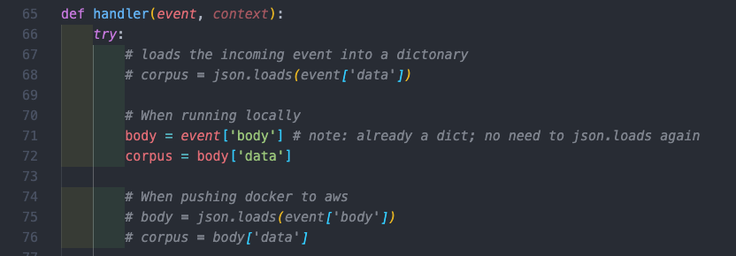

# Rolljak - Text Analytics Microservice
# Getting Started

```bash
# 1. Create venv
python3 -m venv text-analytics-env

# 2. Activate venv
source text-analytics-env/bin/activate

# 3. Install Dependencies
pip install -r requirements.txt
```

## Installing Models 
Source: https://public.ukp.informatik.tu-darmstadt.de/reimers/sentence-transformers/v0.2/ <br>
We are using paraphrase-distilroberta-base-v2 so lets download it.
```bash
1. cd serverless-bert
2. wget https://public.ukp.informatik.tu-darmstadt.de/reimers/sentence-transformers/v0.2/paraphrase-distilroberta-base-v2.zip
```

## API Format

#### Request Body | Expected Input (Data Format From Rails Backend)
```
Request_body: {
        "data": [model_answer, student_res_1, student_res_2, student_res_3] #len = n
    }
```

#### Response Payload
```
{
    "data": [
        {"lexical": 0.5, "semantic": 0.7, "overall": 0.6}, ... , {"lexical": 0.5, "semantic": 0.7, "overall": 0.6}] #len = n-1
}
```

## Note:
Do take note to uncomment the lines accordingly on depending whether you're running docker locally or pushing to aws!



---
# Build Custom `docker` Image
```bash
docker build -t bert-lambda .
```

# Test our function locally
Start docker locally:

```bash
docker run -p 8080:8080 bert-lambda
```

Subsequently, we can then locally invoke the function using `curl`, a REST-Client or run `python req_script.py` and we should expect a 200 status code.

# Deploy a custom `docker` image to ECR

Since we now have a local `docker` image, we can deploy this to ECR. Therefore we need to create an ECR repository with the name `bert-lambda`.

```bash
aws ecr create-repository --repository-name bert-lambda > /dev/null
```

To be able to push our images we need to login to ECR. We need to define some
environment variables to make deploying easier.

```bash
aws_region=ap-southeast-1
aws_account_id=<insert aws_account_id>

aws ecr get-login-password \
    --region $aws_region \
| docker login \
    --username AWS \
    --password-stdin $aws_account_id.dkr.ecr.$aws_region.amazonaws.com
```

Next we need to `tag` / rename our previously created image to an ECR format. The format for this is
`{AccountID}.dkr.ecr.{region}.amazonaws.com/{repository-name}`

```bash
docker tag bert-lambda $aws_account_id.dkr.ecr.$aws_region.amazonaws.com/bert-lambda
```

To check if it worked we can run `docker images` and should see an image with our tag as name

Finally, we push the image to ECR Registry.

```bash
 docker push $aws_account_id.dkr.ecr.$aws_region.amazonaws.com/bert-lambda
```

---

# Deploy AWS Lambda function with a custom `docker` image

```yaml
service: serverless-bert-lambda-docker

provider:
  name: aws # provider
  region: ap-southeast-1 # aws region
  memorySize: 5120 # optional, in MB, default is 1024
  timeout: 60 # optional, in seconds, default is 6

functions:
  lexicalSemanticScoring:
    image: 029104380498.dkr.ecr.ap-southeast-1.amazonaws.com/bert-lambda:latest #ecr url
    events:
      - http:
          path: qa # http path
          method: post # http method
```

For an ECR image, the URL should look like this `{AccountID}.dkr.ecr.{region}.amazonaws.com/{repository-name}@{digest}`

To deploy the function, we run:

```yaml
serverless deploy
```
---

# Test our Serverless `BERT` API

To test our Lambda function, uncomment the "request aws" section and run `python req_script.py`

---